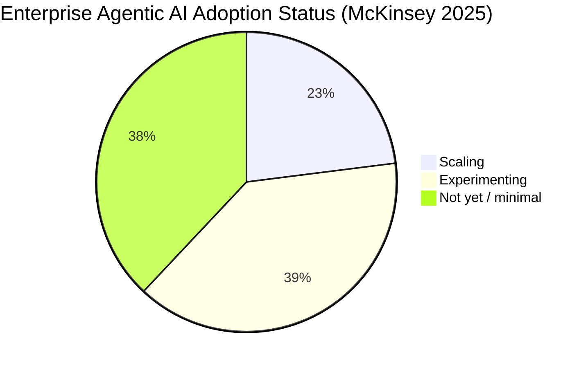
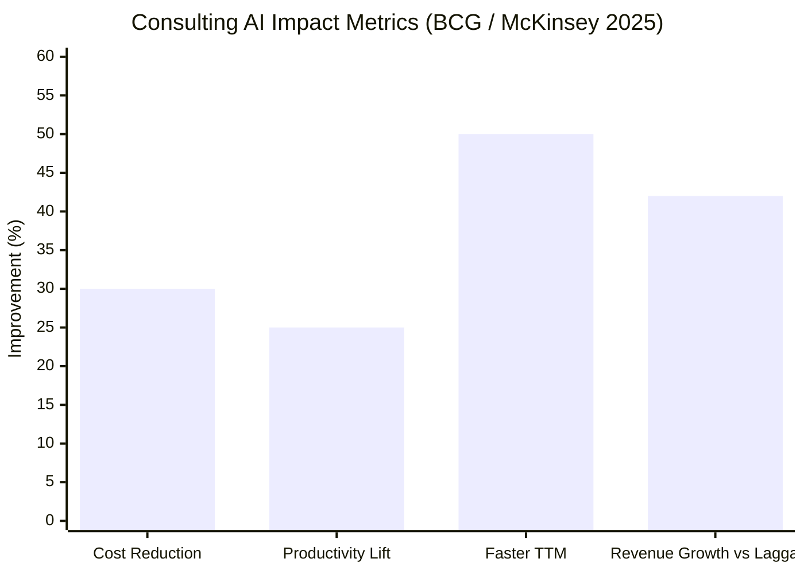
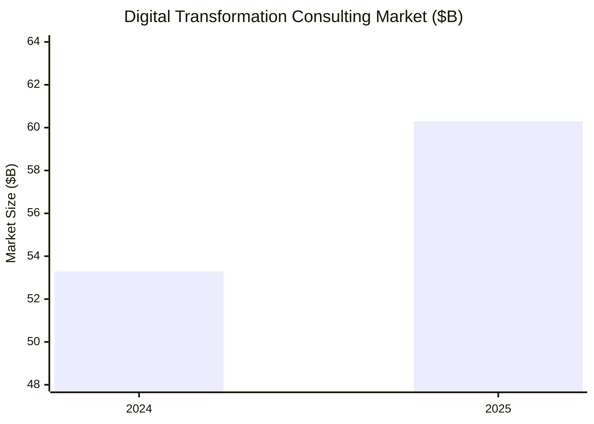
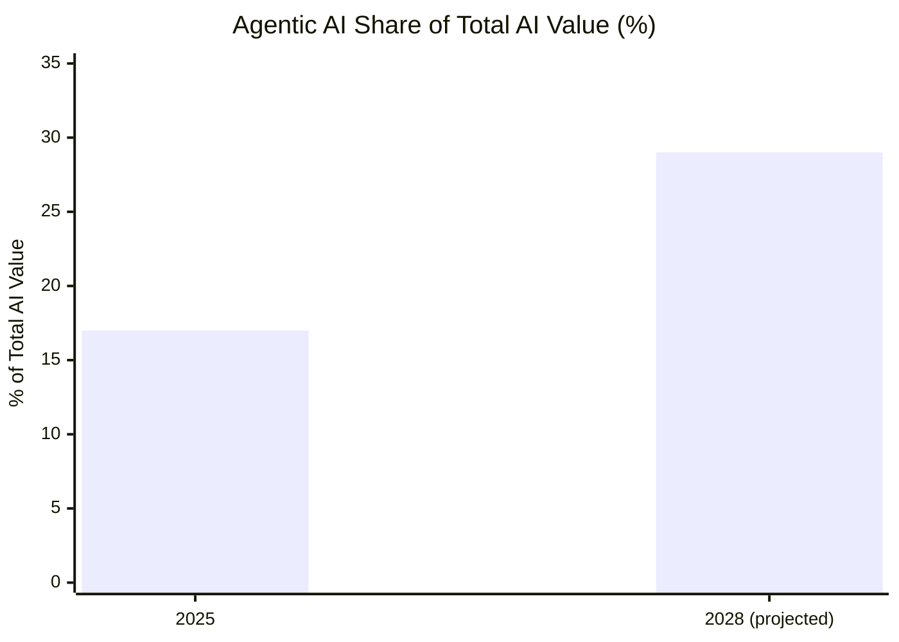

# Research: Latest Trends in Agentic AI + Consulting Firm Adoption
Date: 2026-03-06
Source: Perplexity API (sonar model)
Relevant to: Kearney AI RA interview prep, agentic AI project, LangChain learning goal

---

## Summary

- Multi-agent orchestration is the defining architecture of 2025-2026 — single agents are being replaced by coordinated "squads" of specialized agents
- 82% of Global 2000 companies plan dedicated AI orchestration budgets in 2026; market growing at 43% CAGR
- LangGraph (not LangChain) is the production-grade choice — graph-based state machines, debuggable, low-latency
- AutoGen is being superseded; CrewAI and LangGraph are the two frameworks practitioners are actually using
- MCP is now the "USB-C for AI" — standardizes how agents connect to tools/data; already embedded in healthcare, finance, enterprise systems

---

## Findings

### 1. Multi-Agent Systems — the Dominant Architecture

The field has shifted from single-task agents to coordinated squads:
- Orchestration layers break goals into sub-tasks, route to specialist agents (negotiator, legal, compliance, researcher, coder)
- Creates "digital departments" running 24/7
- Gartner: 15% of work decisions will be autonomous by 2028 (from 0% in 2024); 33% of apps will be agentic
- 82% of Global 2000 planning dedicated orchestration budgets in 2026
- Caveat: 40%+ of projects may fail by 2027 due to infrastructure gaps — governance is the bottleneck

**New pricing models emerging:** AI nurses priced at $10/hr (vs $43/hr human RN), task/hourly billing replacing software licensing

### 2. Framework Landscape

| Framework | Architecture | Best For | Status |
|-----------|-------------|----------|--------|
| **LangGraph** | Graph state machine — nodes, edges, cyclical reasoning | Complex multi-step workflows, production agentic systems | Active — preferred for production |
| **LangChain** | Composable chains, retrievers | Broad LLM app ecosystem, entry-level | Active — foundational, but LangGraph is the evolution |
| **CrewAI** | Role-based orchestration — agents assigned roles and tasks | Structured team-like multi-agent collaboration | Active — strong for defined workflows |
| **AutoGen** | Conversation-based agent dialogue | Human-in-the-loop multi-agent reasoning | Being superseded — Microsoft merging into Agent Framework |

**Key insight:** LangGraph extends LangChain with cyclical graphs — agents can revisit previous steps and adapt. This is the production path. Learn LangGraph specifically, not just LangChain.

### 3. Model Context Protocol (MCP)

- Developed by Anthropic (Nov 2024), donated to Linux Foundation (Dec 2025)
- Architecture: client-server — MCP hosts (agents) connect to MCP servers via RESTful/JSON RPC
- Called the "USB-C for AI" — standardizes agent-tool connectivity across any system
- **Real adoption examples:**
  - Healthcare: Wolters Kluwer, Artera — secure clinical data access for agents, reduces hallucinations
  - Enterprise: Gravitee, Flowhunt — future-proof APIs for AI agent discovery
  - Infrastructure: AWS, GCP, Azure all support MCP
- Use cases: dynamic tool orchestration, multi-agent coordination, secure enterprise data access
- Trajectory: "will become ubiquitous like REST APIs"

**Key insight for Keonhee:** You are already building with MCP (Notion connected). This is not a toy — it is the foundational protocol for the next generation of enterprise AI. Explaining how MCP works and why it matters is a strong differentiator in any AI interview.

### 4. Vertical Specialization

- General-purpose agents giving way to domain-specific agents trained on industry data
- Healthcare, finance, construction, cybersecurity all building narrow agents
- "General-purpose agents aren't enough for legal, health, or manufacturing" (IBM)
- Non-technical users now deploying automations — the tooling has matured enough

---

---

## 5. Consulting Firm Adoption of Agentic AI

### Adoption Maturity

Agentic AI adoption is still early-stage across industries — consulting firms are more aware than most, but true enterprise-scale deployment is rare:

- Only **23%** of companies are currently scaling agentic AI; **39%** are experimenting
- Only **6%** of organizations are classified as "AI high performers" (5%+ EBIT impact)
- **60%** of AI leaders cite legacy system integration as the #1 barrier (Deloitte)

### What Top Firms Are Building

| Firm | Internal Initiative | Focus |
|------|--------------------|----|
| **McKinsey** | QuantumBlack | Moves clients from AI strategy → production systems |
| **BCG** | BCG X | In-house engineering + data science; bridges strategy and implementation |
| **EY** | AI platforms (1,000 agents deployed) | Knowledge management, analytics, client transformation |
| **Deloitte** | AI-enabled delivery | Governance frameworks, workforce upskilling |
| **Kearney** | Agentic AI Trends Report 2026 | Market intelligence; agentic AI market projected at $10.41B in 2025 |

Internal tools are largely treated as **proprietary competitive advantages** — firms do not disclose specifics.

### Business Impact (Client-Reported)

BCG reports clients using shared AI tools + data:
- **30%** cost reduction
- **25%** productivity lift
- **50%** faster time to market

AI leaders outpace laggards:
- **1.7x** revenue growth
- **40%** greater cost savings

### Industry Revenue & Spending

- **Digital transformation consulting**: $60.3B in 2025 (up from $53.3B in 2024) — **13% growth**
- **EY**: 30% AI revenue growth; 15,000+ staff on AI projects; $1B annual AI investment
- **Deloitte**: AI captured 36% of digital budgets; avg $700M for $13B revenue firms

### Agentic AI Share of Total AI Value

BCG data — agentic AI as % of total enterprise AI value:

### Competitive Threat: AI-First Boutiques

Emerging AI-native consulting platforms (Consulting IQ, Xavier AI) use proprietary reasoning engines + prompt libraries to deliver consulting-grade advice at lower cost. This creates an **"AI double squeeze"** for incumbents:
- Revenue loss from commoditized small projects
- Cost pressure from reduced junior roles

**Strategic response**: Top firms are shifting toward outcome-based propositions and doubling AI investment vs. laggards.

### Workforce Impact

- **45%** of AI leaders expect fewer middle-management layers as work shifts toward oversight and orchestration
- Firms are building internal AI academies for upskilling

---

## Sources

- [Agentic AI Trends 2025 — Kanerika](https://kanerika.com/blogs/agentic-ai-trends-2025/)
- [Agentic AI Trends — AIMultiple](https://aimultiple.com/agentic-ai-trends)
- [Agentic AI Strategy — Deloitte Insights](https://www.deloitte.com/us/en/insights/topics/technology-management/tech-trends/2026/agentic-ai-strategy.html)
- [Top 5 AI Agent Frameworks 2025 — Maxim AI](https://www.getmaxim.ai/articles/top-5-ai-agent-frameworks-in-2025-a-practical-guide-for-ai-builders/)
- [CrewAI vs LangGraph vs AutoGen — DataCamp](https://www.datacamp.com/tutorial/crewai-vs-langgraph-vs-autogen)
- [AI Agent Frameworks 2026 — Turing](https://www.turing.com/resources/ai-agent-frameworks)
- [LangChain vs CrewAI vs AutoGen — Trixly AI](https://www.trixlyai.com/blogs/langchain-vs-crewai-vs-autogen-which-ai-agent-framework-should-you-actually-use)
- [MCP and Agentic AI — Flowhunt](https://www.flowhunt.io/blog/mcp-agentic-ai-integration/)
- [MCP Explanation — Artera](https://artera.io/blog/model-context-protocol-explanation/)
- [MCP for Agentic AI — Gravitee](https://www.gravitee.io/blog/mcp-model-context-protocol-agentic-ai)
- [MCP in Healthcare — Wolters Kluwer](https://www.wolterskluwer.com/en/expert-insights/exploring-mcp-how-model-context-protocol-supports-the-future-of-agentic-healthcare)
- [Model Context Protocol — Anthropic](https://www.anthropic.com/news/model-context-protocol)
- [Model Context Protocol — Wikipedia](https://en.wikipedia.org/wiki/Model_Context_Protocol)
- [BCG: Agents Accelerate Next Wave of AI Value](https://www.bcg.com/publications/2025/agents-accelerate-next-wave-of-ai-value-creation)
- [McKinsey: The State of AI 2025](https://www.mckinsey.com/capabilities/quantumblack/our-insights/the-state-of-ai)
- [Deloitte: AI Adoption Challenges](https://www.deloitte.com/us/en/what-we-do/capabilities/applied-artificial-intelligence/blogs/pulse-check-series-latest-ai-developments/ai-adoption-challenges-ai-trends.html)
- [EY Global Revenue 2025](https://www.consulting.us/news/12529/ey-global-posts-4-growth-to-reach-532-billion-in-revenue-in-2025)
- [BCG: AI Leaders Outpace Laggards](https://www.bcg.com/press/30september2025-ai-leaders-outpace-laggards-revenue-growth-cost-savings)
- [Consulting Industry 2025: Digital AI Playbook](https://voltagecontrol.com/articles/consulting-industry-insights-2025-digital-ai-playbook/)
- [Kearney AI Trends Report 2026](https://www.kearney.com/service/digital-analytics/article/kearney-ai-trends-report-2026)
- [McKinsey/BCG AI Competition — Business Insider](https://www.businessinsider.com/mckinsey-bcg-and-deloitte-competition-small-boutique-specialized-ai-2025-4)
